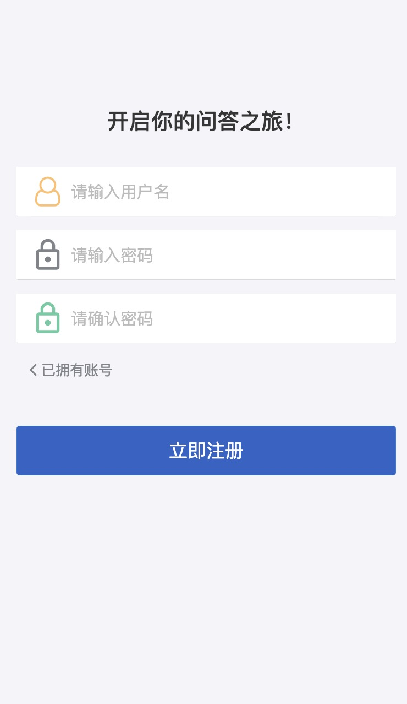
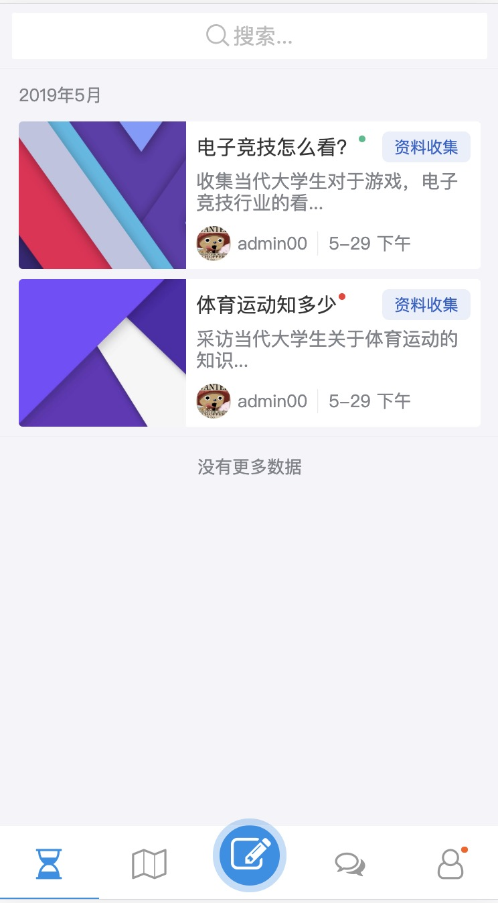
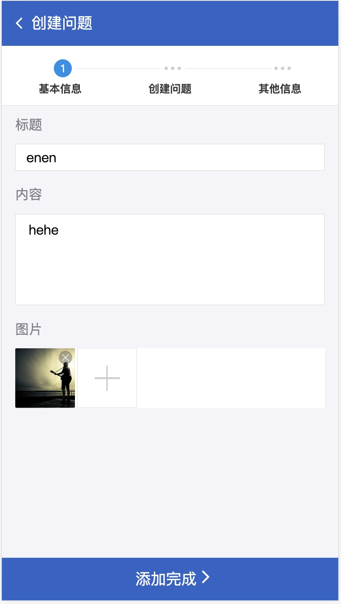
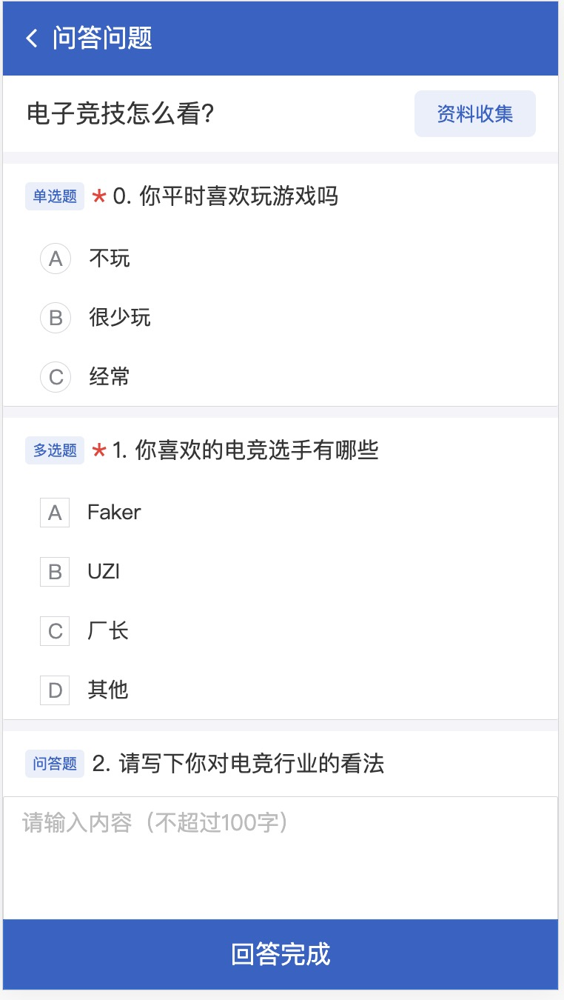
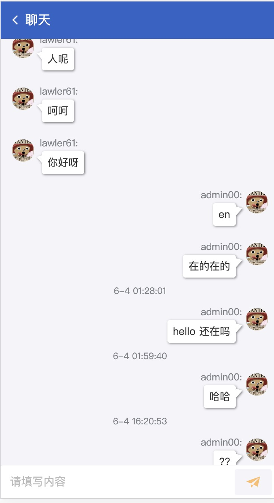
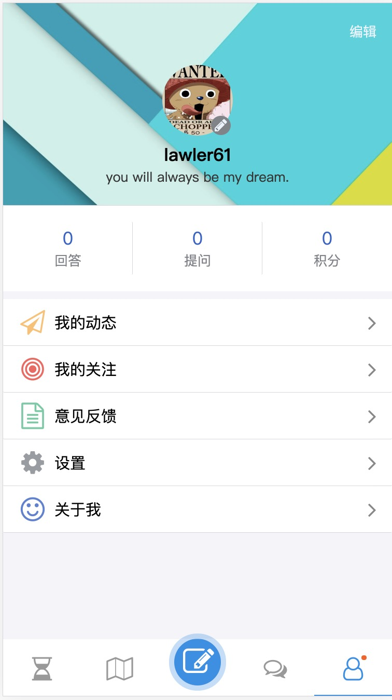

# qa-app

H5 项目，毕业设计

技术栈：react + mobx + router + antd + axios

## 问答系统

用户注册登录后，可创建问题，指定他人回答。创建的问题在 post 界面显示，被指定的用户登录后在 todo 界面显示。被指定用户提交问题后，问题作者可对结果进行收集分析

1. [线上地址，去看看 -> https://qa.omyleon.com](https://qa.omyleon.com)

2. [问答系统 服务端 -> https://github.com/lawler61/qa-app-server](https://github.com/lawler61/qa-app-server)

3. [react 脚手架地址 -> https://github.com/lawler61/react-lighter](https://github.com/lawler61/react-lighter)

## 目录结构

```markdown
├── app // 项目主目录
│   ├── components // 可重用组件
│   ├── index.tsx
│   ├── interface.ts
│   ├── mobx // mobx 注入工具
│   ├── pages // 项目界面
│   │   ├── 404
│   │   ├── Login
│   │   ├── Register
│   │   ├── App
│   │   ├── Todo
│   │   ├── Post
│   │   ├── Create
│   │   ├── Message
│   │   ├── User
│   │   ├── Answer
│   │   └── Example
│   ├── routes
│   ├── tools // 脚手架
│   ├── utils
│   └── websocket
└── config // webpack 配置
```

## 功能

1. 用户：登录、注册、修改基本信息、修改密码、上传头像

2. 创建问题：包括问题基本信息、具体问题、指定人员

3. 完成问题：被指定用户在规定时间内完成问题，并提交

4. 收集问题：被指定用户都作答完成后，问题作者可对问题进行收集和分析

5. 聊天：用户之间添加好友，进行简单聊天

## 运行

```bash
yarn or npm i

yarn dll

yarn start // for dev

yarn build && yarn server // for prod
```

## 项目部分截图

1. signup 界面



2. todo 界面



3. create 界面1



4. create 界面2


5. answer 界面



6. chat 界面



7. user 界面



## 感谢

1. 项目所使用库的贡献者们

2. [kuitos 的 ts-plugin-mmlpx 插件](https://github.com/mmlpxjs/ts-plugin-mmlpx)

3. [luruozhou 的 mobx 项目最佳实践](https://github.com/luruozhou/mobx-example)

4. [zhaotoday 的 axios 封装](https://github.com/zhaotoday/rest)

5. [yapi 平台](https://github.com/YMFE/yapi)
